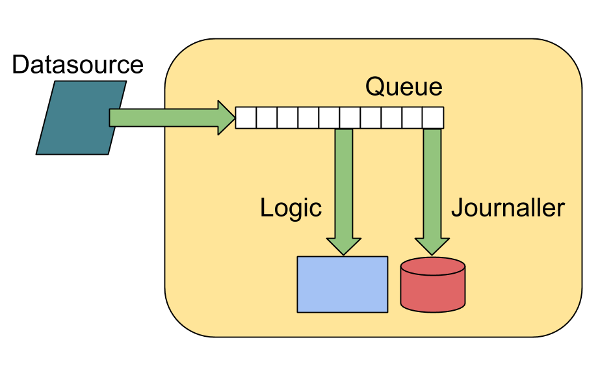

System Jitter Utility
=====================

A test program for exploring causes of jitter.

The application
===============

The application consists of 3 threads:

1. The producer thread - responsible for reading data from a memory-mapped file, inserting a timestamp, and publishing messages onto a queue (an instance of the [Disruptor] (https://github.com/LMAX-Exchange/disruptor)).
2. The accumulator thread - records a timestamp when it pulls a message from the queue, and stores the queue transit latency in a histogram.
3. The journaller thread - records a timestamp when it pulls a message from the queue, writes an entry to a journal containing the queue transit latency.

All timestamps are generated by calling `System.nanoTime()`.

The producer thread will busy-spin for ten microseconds between each publication. Consumers threads are busy-waiting on the head of the queue for messages to arrive from the producer.

Four latencies are recorded:

1. Queue transit time for accumulator thread
2. Queue transit time for journaller thread
3. Inter-message time for accumulator thread
4. Inter-message time for journaller thread

On system exit, full histograms of these values are generated for post-processing. 

Using
=====

1. Clone this git repository
2. Build the library: `./gradlew bundleJar`
3. Run it: `cd src/main/shell && bash ./run_test.sh`

Output
======

The `run_test.sh` script will run the application. At exit, the application will print out a number of latency histograms.

Below is an excerpt of the output containing the histogram of latencies recorded between the producer thread and the accumulator thread.

    == Accumulator Message Transit Latency (ns) ==
    min                    136
    50.00%                 175
    90.00%                 191
    99.00%                 247
    99.90%                 319
    99.99%                 543
    max                  11263
    count                89991

Tools to install
================

Install the following tools in order to work through the exercises:

1. gnuplot
2. perf
3. hwloc
4. trace-cmd
