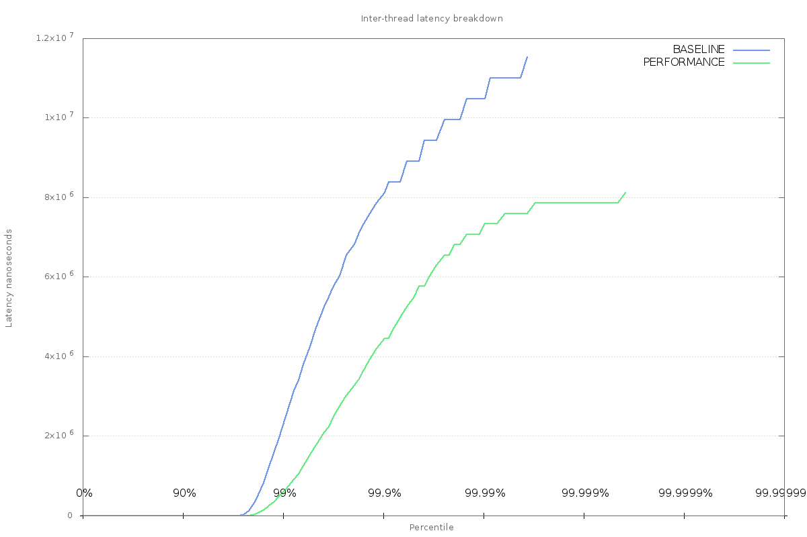

System Jitter Utility
=====================

A test program for exploring causes of jitter.

The application
===============

The application consists of 3 threads:

1. The producer thread - responsible for reading data from a memory-mapped file, inserting a timestamp, and publishing messages onto a queue (an instance of the [Disruptor] (https://github.com/LMAX-Exchange/disruptor)).
2. The accumulator thread - records a timestamp when it pulls a message from the queue, and stores the queue transit latency in a histogram.
3. The journaller thread - records a timestamp when it pulls a message from the queue, writes an entry to a journal containing the queue transit latency.

All timestamps are generated by calling `System.nanoTime()`.

The producer thread will busy-spin for ten microseconds between each publication. Consumer threads are busy-waiting on the head of the queue for messages to arrive from the producer.

The application is garbage-free, and [guaranteed safepoints] (https://epickrram.blogspot.co.uk/2015/08/jvm-guaranteed-safepoints.html) are disabled, so there should be no jitter introduced by the JVM itself.

Four latencies are recorded:

1. Queue transit time for accumulator thread
2. Queue transit time for journaller thread
3. Inter-message time for accumulator thread
4. Inter-message time for journaller thread

On system exit, full histograms of these values are generated for post-processing (placed in `/tmp/` by default). 

Requirements
============

1. JDK 8+

Tools to install
================

Install the following tools in order to work through the exercises:

1. gnuplot
2. perf
3. hwloc
4. trace-cmd
5. powertop

Using
=====

1. Clone this git repository
2. Build the library: `./gradlew bundleJar`
3. Run it: `cd src/main/shell && bash ./run_test.sh BASELINE`

Output
======

The `run_test.sh` script will run the application, using 'BASELINE' as a label. At exit, the application will print out a number of latency histograms.

Below is an excerpt of the output containing the histogram of latencies recorded between the producer thread and the accumulator thread.

    == Accumulator Message Transit Latency (ns) ==
    mean                   60879
    min                       76
    50.00%                   168
    90.00%                   256
    99.00%               2228239
    99.90%               8126495
    99.99%              10485823
    99.999%             11534399
    99.9999%            11534399
    max                 11534399
    count                3595101

So for this run, 3.5m messages were passed through the queue, the mean latency was around 60 microseconds, 
min latency was 75 nanoseconds, and the max latency was over 11 milliseconds.

These numbers can be plotted on a chart using the following command, executed from `src/main/shell`:

`bash ./chart_accumulator_message_transit_latency.sh`

and viewed with the following command:

`gnuplot ./accumulator_message_transit_latency.cmd`

producing something that looks like this chart:

Why so slow?
============

From these first results, we can see that at the 99th percentile, inter-thread latency was over 2 milliseconds, 
meaning that 1 in 100 messages took 2ms or longer to transit between two threads.

Since no other work is being done by this program, the workload is constant, and there are no runtime pauses, 
where is this jitter coming from?

Below are a series of steps working through some causes of system jitter on a modern Linux kernel 
(my laptop is running Fedora 22 on kernel 4.0.4).  Most of these techniques have been tested on a 3.18 kernel, 
older versions may not have the same features/capabilities.

CPU speed
=========

Modern CPUs (especially on laptops) are designed to be power efficient, this means that the OS will typically try 
to scale down the clock rate when there is no activity. On Intel CPUs, this is partially handled using power-states,
which allow the OS to reduce CPU frequency, meaning less power draw, and less thermal overhead.

On current kernels, this is handled by the CPU scaling governor. You can check your current setting by looking in the file

`/sys/devices/system/cpu/cpu0/cpufreq/scaling_governor`

on my laptop, this is set to `powersave` mode. To see available governors:

`cat /sys/devices/system/cpu/cpu0/cpufreq/scaling_available_governors`

which tells me that I have two choices:

1. performance
2. powersave

Before making a change though, let's make sure that powersave is actually causing us issues.

To do this, we can use [perf_events] (https://perf.wiki.kernel.org/index.php/Main_Page) 
to monitor the CPU's P-state while the application is running:
 
`perf record -e "power:cpu_frequency" -a`
 
This command will sample the cpu_frequency trace point written to by the intel cpufreq driver on all CPUs. This information comes
from an MSR on the chip which holds the FSB speed.

Hit Ctrl+c once the application has finished running, then use `perf script` to view the available output.

Filtering entries to include only those samples taken when `java` was executing shows some variation in the reported frequency:

    java  2804 [003]  3327.796741: power:cpu_frequency: state=1500000 cpu_id=3
    java  2804 [003]  3328.089969: power:cpu_frequency: state=3000000 cpu_id=3
    java  2804 [003]  3328.139009: power:cpu_frequency: state=2500000 cpu_id=3
    java  2804 [003]  3328.204063: power:cpu_frequency: state=1000000 cpu_id=3

Set the scaling governor to performance mode to reduce this:

`sudo bash ./set_cpu_governor.sh performance`

and re-run the test while using `perf` to record `cpu_frequency` events. If the change has taken effect, 
there should be no events output by `perf script`.

Running the test again with the performance governor enabled produces better results for inter-thread latency:

    == Accumulator Message Transit Latency (ns) ==
    mean                   23882
    min                       84
    50.00%                   152
    90.00%                   208
    99.00%                589827
    99.90%               4456479
    99.99%               7340063
    99.999%              7864351
    99.9999%             8126495
    max                  8126495
    count                3595101

Though there is still a max latency of 8ms, it has been reduced from the previous value of 11ms.

The effect is clearly visible when added to the chart. To add the new data, go through the steps followed earlier:

`bash ./chart_accumulator_message_transit_latency.sh`
`gnuplot ./accumulator_message_transit_latency.cmd`

