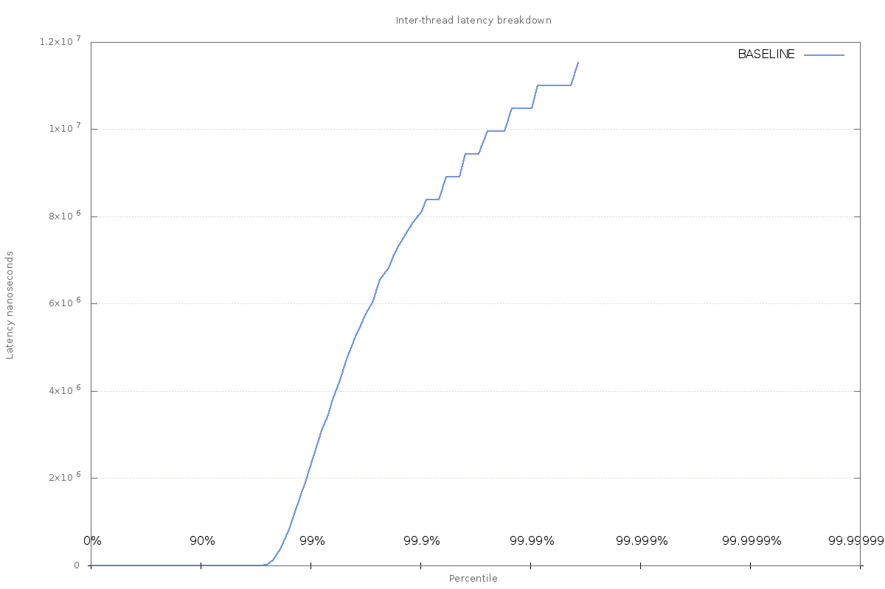

System Jitter Utility
=====================

A test program for exploring causes of jitter.

The application
===============

The application consists of 3 threads:

1. The producer thread - responsible for reading data from a memory-mapped file, inserting a timestamp, and publishing messages onto a queue (an instance of the [Disruptor] (https://github.com/LMAX-Exchange/disruptor)).
2. The accumulator thread - records a timestamp when it pulls a message from the queue, and stores the queue transit latency in a histogram.
3. The journaller thread - records a timestamp when it pulls a message from the queue, writes an entry to a journal containing the queue transit latency.

All timestamps are generated by calling `System.nanoTime()`.

The producer thread will busy-spin for ten microseconds between each publication. Consumer threads are busy-waiting on the head of the queue for messages to arrive from the producer.

The application is garbage-free, and [guaranteed safepoints] (https://epickrram.blogspot.co.uk/2015/08/jvm-guaranteed-safepoints.html) are disabled, so there should be no jitter introduced by the JVM itself.

Four latencies are recorded:

1. Queue transit time for accumulator thread
2. Queue transit time for journaller thread
3. Inter-message time for accumulator thread
4. Inter-message time for journaller thread

On system exit, full histograms of these values are generated for post-processing (placed in `/tmp/` by default). 

Requirements
============

1. JDK 8+

Tools to install
================

Install the following tools in order to work through the exercises:

1. gnuplot
2. perf
3. hwloc
4. trace-cmd

Using
=====

1. Clone this git repository
2. Build the library: `./gradlew bundleJar`
3. Run it: `cd src/main/shell && bash ./run_test.sh BASELINE`

Output
======

The `run_test.sh` script will run the application, using 'BASELINE' as a label. At exit, the application will print out a number of latency histograms.

Below is an excerpt of the output containing the histogram of latencies recorded between the producer thread and the accumulator thread.

    == Accumulator Message Transit Latency (ns) ==
    mean                   60879
    min                       76
    50.00%                   168
    90.00%                   256
    99.00%               2228239
    99.90%               8126495
    99.99%              10485823
    99.999%             11534399
    99.9999%            11534399
    max                 11534399
    count                3595101

So for this run, 3.5m messages were passed through the queue, the mean latency was around 60 microseconds, 
min latency was 75 nanoseconds, and the max latency was over 11 milliseconds.

These numbers can be plotted on a chart using the following command, executed from `src/main/shell`:

`bash ./chart_accumulator_message_transit_latency.sh`

and viewed with the following command:

`gnuplot ./accumulator_message_transit_latency.cmd`

producing something that looks like this chart:

